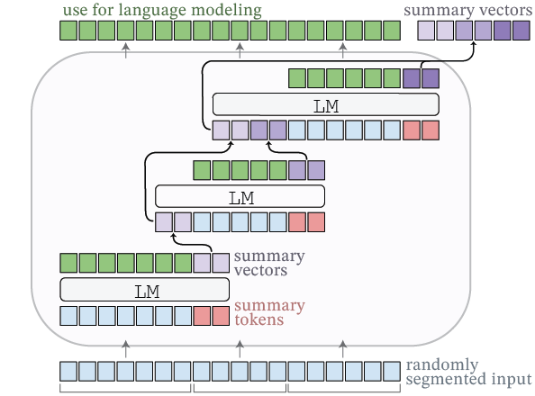

# Adapting Language Models to Compress Long Contexts

This is the official implementation of the paper [Adapting Language Models to Compress Long Contexts](https://arxiv.org/abs/2305.14788), in which we train *AutoCompressors* which are language models with the new capability to (1) compress context information into a small set of summary vectors and (2) reason over these summary vectors which are passed to the model as soft prompts.

<br>
<p align="center">

</p>
<br>

Example use of the API with a pre-trained AutoCompressor model:
```python
from transformers import AutoTokenizer
from auto_compressor import AutoCompressorModel

# Load a model pre-trained on 6k tokens in 4 compression steps
tokenizer = AutoTokenizer.from_pretrained("princeton-nlp/AutoCompressor-2.7b-6k")
model = AutoCompressorModel.from_pretrained("princeton-nlp/AutoCompressor-2.7b-6k").eval()

prompt = 'The first name of the current US president is "'
prompt_tokens = tokenizer(prompt, return_tensors="pt").input_ids

context = """Joe Biden, born in Scranton, Pennsylvania, on November 20, 1942, had a modest upbringing in a middle-class family. He attended the University of Delaware, where he double-majored in history and political science, graduating in 1965. Afterward, he earned his law degree from Syracuse University College of Law in 1968.\nBiden's early political career began in 1970 when he was elected to the New Castle County Council in Delaware. In 1972, tragedy struck when his wife Neilia and 1-year-old daughter Naomi were killed in a car accident, and his two sons, Beau and Hunter, were injured. Despite this devastating loss, Biden chose to honor his commitment and was sworn in as a senator by his sons' hospital bedsides.\nHe went on to serve as the United States Senator from Delaware for six terms, from 1973 to 2009. During his time in the Senate, Biden was involved in various committees and was particularly known for his expertise in foreign affairs, serving as the chairman of the Senate Foreign Relations Committee on multiple occasions.\nIn 2008, Joe Biden was selected as the running mate for Barack Obama, who went on to win the presidential election. As Vice President, Biden played an integral role in the Obama administration, helping to shape policies and handling issues such as economic recovery, foreign relations, and the implementation of the Affordable Care Act (ACA), commonly known as Obamacare.\nAfter completing two terms as Vice President, Joe Biden decided to run for the presidency in 2020. He secured the Democratic nomination and faced the incumbent President Donald Trump in the general election. Biden campaigned on a platform of unity, promising to heal the divisions in the country and tackle pressing issues, including the COVID-19 pandemic, climate change, racial justice, and economic inequality.\nIn the November 2020 election, Biden emerged victorious, and on January 20, 2021, he was inaugurated as the 46th President of the United States. At the age of 78, Biden became the oldest person to assume the presidency in American history.\nAs President, Joe Biden has worked to implement his agenda, focusing on various initiatives, such as infrastructure investment, climate action, immigration reform, and expanding access to healthcare. He has emphasized the importance of diplomacy in international relations and has sought to rebuild alliances with global partners.\nThroughout his long career in public service, Joe Biden has been recognized for his commitment to bipartisanship, empathy, and his dedication to working-class issues. He continues to navigate the challenges facing the nation, striving to bring the country together and create positive change for all Americans."""

context_tokens = tokenizer(context, return_tensors="pt").input_ids
summary_vectors = model(context_tokens, output_softprompt=True).softprompt
print(f"Compressing {context_tokens.size(1)} tokens to {summary_vectors.size(1)} summary vectors")
# >>> Compressing 535 tokens to 50 summary vectors

next_token = model(prompt_tokens, softprompt=summary_vectors).logits[0,-1].argmax()
print("Next token w/ summary vectors:\n" + prompt + tokenizer.decode(next_token))
# >>> Next token w/ summary vectors:
# >>> The first name of the current US president is "Joe

next_token_without_context = model(prompt_tokens).logits[0,-1].argmax()
print("Next token w/o context:\n" + prompt + tokenizer.decode(next_token_without_context))
# >>> Next token w/o context:
# >>> The first name of the current US president is "Bar
```


### Install
Setup a new environment and install the most recent version of [pytorch](https://pytorch.org/),
followed by these libraries
```bash
pip install transformers==4.28.1 datasets==2.11.0 wandb
```

### Training
`train.sh` is the main method for training AutoCompressors and defines the most important hyperparameters for `train.py`.
You may have adjust some setting, like the number GPUs, depending on the system.
The script should be easy to get started with, since it uses pre-tokenized datasets from the huggingface hub.

**Flash attention:**
We implement flash attention via `torch.nn.functional.scaled_dot_product_attention`, which you can use by adding `--fast_attention` to `train.sh`. This lowers the GPU memory requirements during training substantially. Note that this is experimental and requires the preview version of pytorch. We have encountered some issues with using fast attention during evaluation, especially with `use_cache=True`, so we recommend only using the fast attention during training.

### Pre-trained Models
All the fine-tuned models from our paper can be found on Huggingface hub:
|Link|Base model|Fine-tuning seq. length|Fine-tuning data|#Summary vectors|Summmary accumulation|Randomized segmenting|Softprompt stop gradient|
|-|-|-|-|-|-|-|-|
| [princeton-nlp/AutoCompressor-2.7b-6k](https://huggingface.co/princeton-nlp/AutoCompressor-2.7b-6k) | OPT-2.7b | 6144 tokens / seq. in 4 compression steps | 2B tokens across 4 domains from the Pile | 50 / compression step | ✔️ | ✔️ | ✔️ |
| [princeton-nlp/RMT-2.7b-8k](https://huggingface.co/princeton-nlp/RMT-2.7b-8k) | OPT-2.7b | 8192 tokens / seq. in 4 compression steps | 2B tokens across 4 domains from the Pile | 50 | | | |
| [princeton-nlp/FullAttention-2.7b-4k](https://huggingface.co/princeton-nlp/FullAttention-2.7b-4k) | OPT-2.7b | 4092 tokens / seq. without compression | 2B tokens from 4 domains from the Pile | - | | | |
| [princeton-nlp/AutoCompressor-2.7b-30k](https://huggingface.co/princeton-nlp/AutoCompressor-2.7b-30k) | OPT-2.7b | 30720 tokens / seq. in 20 compression steps | 2B tokens from Books3 from the Pile | 50 / compression step | ✔️ | ✔️ | ✔️ |
| [princeton-nlp/AutoCompressor-1.3b-30k](https://huggingface.co/princeton-nlp/AutoCompressor-1.3b-30k) | OPT-1.3b | 30720 tokens / seq. in 20 compression steps | 2B tokens from Books3 from the Pile | 50 / compression step | ✔️ | ✔️ | ✔️ |
| [princeton-nlp/AutoCompressor-1.3b-30k](https://huggingface.co/princeton-nlp/RMT-1.3b-30k) | OPT-1.3b | 30720 tokens / seq. in 15 compression steps | 2B tokens from Books3 from the Pile | 50 | | | |

The models and their tokenizers can be loaded by importing AutoCompressorModel:
```python
from transformers import AutoTokenizer
from auto_compressor import AutoCompressorModel

tokenizer = AutoTokenizer.from_pretrained("princeton-nlp/AutoCompressor-2.7b-6k")
model = AutoCompressorModel.from_pretrained("princeton-nlp/AutoCompressor-2.7b-6k")
```

The summary vectors for a given context can be obtained in two ways:
1. **Explicitly:** Call the model with `out = model(input_ids, attention_mask, ..., output_softprompt=True)` and obtain the summary vectors as `summary_vectors = out.softprompt` which can be passed to further calls by `model(..., softprompt=sumary_vectors)`.
2. **Implicitly:** Call the model with `out = model(input_ids, segment_lengths=segment_lengths)`, where `segment_lengths` is a list of integers that should add up to the overall sequence length `input_ids.size(1)`. After each segment, the model will automatically generate the summary vectors and prepend them to the next segment. This can still be combined with `output_softprompt=True` to generate the final summary vectors for the entire input. This is convenient for multi-step compression of long inputs, which would otherwise exceed the model's maximum position.

## Bug or Questions?
If you have any questions related to the code or the paper, feel free to email
Alexis and Alexander (`achevalier@ias.edu, awettig@cs.princeton.edu`).
If you encounter a problem or bug when using the code, you can open an issue.
Please try to specify the problem with detail so we can help you quickly!

## Citation
```bibtex
@article{chevalier2023adapting,
   title={Adapting Language Models to Compress Contexts},
   author={Chevalier, Alexis and Wettig, Alexander and Ajith, Anirudh and Chen, Danqi},
   journal={arXiv preprint 2305.14788},
   year={2023}
}
```
